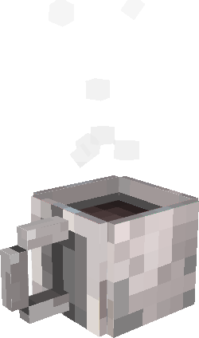

[EN](README.md) | [FR](README.fr.md)

<h3>Yoann Saunier</h3>
<strong>Tech Lead & Senior Software Engineer</strong>
 
<code>HealthTech</code> · <code>M.Sc.</code> · <code>Quebec, Canada</code>

 

---

I build backends that hold up, infrastructure that scales, and occasionally rescue frontends. Also doing freelance web development on the side.

Check out [ysaunier.dev](https://ysaunier.dev) for my personal platform (yes, there's a spinning 3D coffee cup).

### Currently

- :wrench: Building **wtch**, a system tray monitor for cloud services *(Rust + Tauri + Vue)*
- :video_game: Prototyping **Isekai**, an adventure RPG in Godot 4
- :test_tube: Experimenting with multi-agent AI systems *(AI-Parlement)*

### Tech Stack

**Backend & Systems**

**Frontend**

**Infra & DevOps**

**Side quests**

### Featured Projects

| | Project | Description | Stack |
|---|---|---|---|
| :satellite: | [**wtch**](https://github.com/ysaunier/wtch) | Lightweight system tray app for monitoring cloud services. 375+ presets. | Rust, Tauri, Vue |
| :globe_with_meridians: | **ysaunier.dev** | Personal platform built as micro-frontends with Module Federation. | TypeScript, Vue 3, Hono |
| :video_game: | **isekai** | Adventure RPG built in Godot 4. Procedural generation and narrative systems. | GDScript, Godot 4 |
| :classical_building: | **AI-Parlement** | Multi-agent parliamentary simulation. LLM agents debating and voting. | Python, AI/LLM |

---

[:globe_with_meridians: ysaunier.dev](https://ysaunier.dev) · [:briefcase: LinkedIn](https://linkedin.com/in/ysaunier) · [:email: Email](mailto:yoann@ysaunier.dev) · [:coffee: Buy me a coffee](https://buymeacoffee.com/ysaunier)

This README was typed with care and a suspicious amount of coffee.
